The contribution graph below uses the activity graph project’s documented endpoint and a 31-day window. (github.com)

# 📈 Activity Dashboard

**A view of the code and contributions behind this profile.**

[Home](../README.md) · [About](ABOUT.md) · [Focus Areas](FOCUS.md) · [Toolbox](TOOLBOX.md) · **Activity**

---

## ⚡ GitHub statistics

  

## 📊 Language distribution

  

Repository language distribution describes code volume, not proficiency.

## 🌊 Contribution timeline

## 🔗 Explore the source

- [Public repositories](https://github.com/siddharthmohan619-eng?tab=repositories)
- [GitHub profile and contribution calendar](https://github.com/siddharthmohan619-eng)
- [Profile card workflow runs](https://github.com/siddharthmohan619-eng/siddharthmohan619-eng/actions)

---

  <a href="TOOLBOX.md">← Toolbox</a>
  &nbsp; · &nbsp;
  <a href="../README.md">Return home ↗</a>

